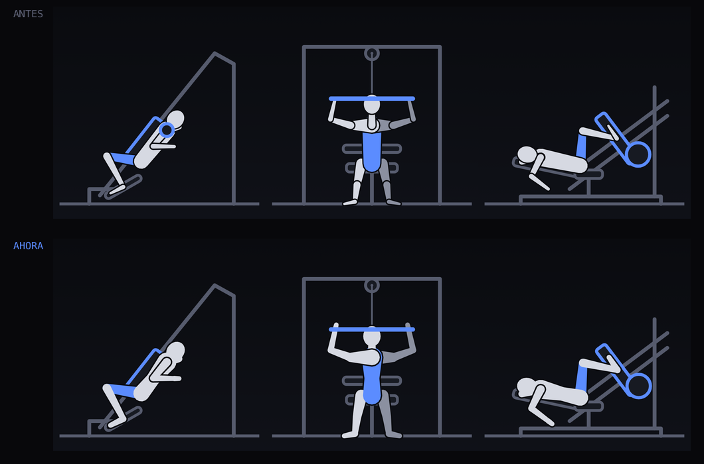

# Los dibujos

Estado al 2026-08-07.

## Qué se arregló

### La trayectoria de las articulaciones

Antes cada ejercicio interpolaba en línea recta entre sus dos poses, así que la
rodilla y el codo cortaban camino por adentro en vez de describir un arco, y los
miembros se estiraban y encogían a mitad de la animación —hasta 25 px sobre un
lienzo de 200 en el femoral tumbado—.

`poseAt()` ahora clasifica cada cadena de dos huesos mirando cuánto se mueve
cada punto entre las dos poses dibujadas:

- **Máquinas de aislamiento** (femoral sentado y tumbado, predicador, pushdown,
  martillo, pec deck, face pull): la articulación del medio no se mueve porque
  *es* el eje de la máquina. La punta gira alrededor de ella.
- **Máquinas de empuje** (prensa, hack, press de pecho y hombro, jalón, remo,
  pullover): rodilla y codo van libres y los que manda la máquina son los
  extremos —el pie sobre el riel, la manija sobre el recorrido del cable—. El
  punto del medio se resuelve por cinemática inversa de dos huesos.
- Si ninguno de los dos modelos reproduce las poses dibujadas, se deja la
  interpolación lineal de antes.

No se tocó una sola coordenada de `program.ts`: en `t=0` y `t=1` el resultado es
**exactamente** la pose original (error máximo 0,0000), así que la geometría
validada contra fotos sigue intacta. Lo único que cambia es el camino entre las
dos. El largo de los miembros ya no se sale del rango de las poses (drift máximo
0,07 px contra 25 px antes), y 16 de los 18 ejercicios se separan de la recta más
de 1 px, hasta 39 px. Los dos que no: en los gemelos el cuerpo entero se traslada
y en el crunch el recorrido ya era prácticamente recto.

Costo: ~60 líneas en `program.ts`, cero datos nuevos, cero dependencias.

### La figura

Era un palote: líneas de ancho fijo entre articulaciones. Ahora cada hueso es una
cápsula de radio distinto en cada punta —el muslo es grueso en la cadera y afina
en la rodilla— y el músculo que trabaja se rellena en el color de acento en vez
de solo pintar la línea. En vista frontal el lado lejano va en un gris más
apagado, así se lee la profundidad.

Con las cápsulas cada una con su contorno el cuerpo parecía un maniquí de
madera: se veían las costuras entre muslo y pantorrilla, entre torso y pierna.
Ahora cada cadena se dibuja como **una sola silueta** —primero todas las piezas
engordadas en el color del contorno, después los rellenos sin trazo—, así el
contorno queda solo por fuera y adentro no hay uniones. Las cadenas que se
superponen entre sí —el brazo sobre el torso, la pierna lejana sobre la
cercana— van en grupos separados, para que ahí sí quede la línea que las
distingue.

El torso dejó de ser una cápsula sola: es pelvis y caja torácica con la cintura
más angosta en el medio. Y la mano es un bloque corto en la prolongación del
antebrazo, que antes terminaba en punta.

El equipo que toca al cuerpo —manijas, barras, rodillos— se dibuja **encima** de
la figura; la estructura de la máquina sigue detrás. Con el cuerpo macizo, si no,
el rodillo del femoral quedaba tapado. La excepción es el arnés de hombros de la
hack y los gemelos, que va detrás porque encima le tapa la cabeza a la figura.

Sale de las mismas coordenadas de siempre: no hay datos nuevos ni assets. +0,5 KB
gzip contra el palote.

No es el render 3D anatómico de apps como Kaizen. Ese estilo es media comercial
de [Gym Visual](https://gymvisual.com/) —los datasets de GitHub que lo
redistribuyen lo dicen explícitamente— y no se puede usar en un repo público sin
licencia propia.

### La foto de la máquina

El esquema dice cómo se mueve el cuerpo pero no alcanza para saber si estás
parado frente a la máquina correcta. Cada ejercicio tiene ahora un panel
plegable con dos fotos reales, inicio y fin, que coinciden con las dos fases que
ya etiquetaba la animación.

Van cerradas por defecto y con `loading="lazy"`, así que no se descargan hasta
que las abrís: ~28 KB por ejercicio, 1 MB en total en el repo, 0 en la carga
inicial. El service worker las cachea al vuelo, así que una vez vistas quedan
disponibles offline.

Las fotos salen de [`free-exercise-db`](https://github.com/yuhonas/free-exercise-db)
(Unlicense, dominio público). El mapeo está en `scripts/fetch-ref-photos.mjs` y
se puede regenerar con `node scripts/fetch-ref-photos.mjs`. Dos son
aproximaciones: el dataset no tiene elevaciones laterales en máquina (se usa la
versión en polea) ni remo con pecho apoyado (se usa el T-bar tumbado).

## Qué sigue mal

- **El cuerpo no tiene detalle anatómico.** Tiene volumen y proporciones, pero
  los músculos son segmentos enteros pintados, no grupos musculares dibujados.
  Un escalón más sería darle forma a cada grupo dentro del segmento.
- **Varias máquinas están dibujadas de memoria** y se parecen más a la categoría
  de máquina que a la del gimnasio. Con las fotos ya en el repo, corregir las
  coordenadas de `program.ts` mirándolas es trabajo mecánico y no suma bytes.

## Material OSS: qué se miró y qué se descartó

| Fuente | Licencia | Qué tiene | Veredicto |
| --- | --- | --- | --- |
| [yuhonas/free-exercise-db](https://github.com/yuhonas/free-exercise-db) | Unlicense (dominio público) | 873 ejercicios, 2 fotos reales cada uno, JSON con músculos e instrucciones | **Elegido.** 16 de los 18 ejercicios tienen la máquina exacta. Sin atribución obligatoria ni licencia viral. |
| [chaosbastler/opentraining-exercises](https://github.com/chaosbastler/opentraining-exercises) (dibujos de Everkinetic) | CC-BY-SA 3.0 | 71 ejercicios × 2 poses, ya en SVG | Descartado. Es casi todo peso libre y pelota: de las 18 máquinas del programa solo aparece la prensa. Además ~56 KB por SVG sin optimizar y CC-BY-SA obliga a compartir igual cualquier derivado. |
| [ExerciseDB](https://github.com/exercisedb/exercisedb-api), [exercises-dataset](https://github.com/hasaneyldrm/exercises-dataset) | API abierta, media de licencia poco clara | GIFs animados, 1000+ ejercicios | Descartado. La animación ya la tenemos y ahora es correcta; lo que falta es exactitud, y la licencia de las imágenes no está clara. |
